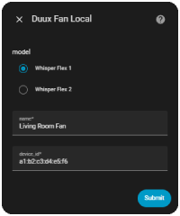
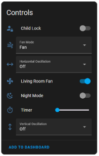
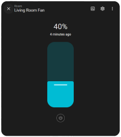
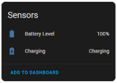

# 🌀 Duux Fan – Local Integration for Home Assistant

**Take back control of your Duux fan - locally, privately, and cloud-free.**

This project allows you to use your **Duux Whisper Flex smart fan** entirely outside of Duux’s cloud ecosystem by redirecting its MQTT communication to a **local broker** , giving you full local control via **Home Assistant**.

No cloud. No account. No lag.

## 📌 Supported Models

This integration has been tested and validated on the following models:

- **DUUX Whisper Flex 1** (v1 generation)
- **DUUX Whisper Flex 2** (v2 generation)

### Model Differences

The integration automatically adapts to your fan's capabilities based on the generation you select:

**Whisper Flex 1 (v1):**
- Speed range: 0-26
- Mode options: Normal, Natural, Night
- Horizontal oscillation: On/Off
- Vertical oscillation: On/Off

**Whisper Flex 2 (v2):**
- Speed range: 0-30
- Mode options: Fan, Natural
- Horizontal oscillation: Off, 30°, 60°, 90°
- Vertical oscillation: Off, 45°, 100°
- Child Lock
- Night Mode: On/Off

Other models may work but are not officially supported.
Please contribute your feedback to help improve compatibility.

## 🧩 Installation via HACS

This integration is not (yet) available in the official HACS default repository list.
However, you can easily add it as a **custom repository**:

1. Open **HACS** in your Home Assistant interface
2. Click the **three dots (⋮)** in the top-right corner and select **"Custom repositories"**
3. Paste the following URL:
   `https://github.com/LouisR-git/duux-fan-local`
4. Select **"Integration"** as the category
5. Click **Add**, then search for `Duux Fan Local` in HACS and install it
6. Restart Home Assistant to finalize the setup

The integration will now appear like any standard Home Assistant integration.

### Initial setup

1. Follow the instructions below to install the required prerequisites:
   - ✅ **MQTT Broker** (e.g., Mosquitto)
   - ✅ **DNS redirection** (reroute Duux API calls to your local Broker)
2. In Home Assistant, go to **Settings > Devices & Services > Add Integration** and search for **Duux Fan Local**.
3. Select your fan model from the list.
4. Give your device a friendly name.
5. Enter the **MAC address** of your Duux fan
   > 💡 You can find it in your router’s connected devices list.
6. Click **Submit** and enjoy local control of your fan!

### Screenshots






## 🧰 Prerequisites

Duux fans communicate with the cloud using **MQTT over TLS**.
By **spoofing the cloud hostname** and running your own MQTT broker, you can intercept this traffic and integrate the fan directly into **Home Assistant**.

You’ll need:

- **Control over your local DNS resolution** (AdGuard, CoreDNS, dnsmasq…)
- **A self-hosted MQTT broker**, reachable as `collector3.cloudgarden.nl` on port 443
- Basic Linux CLI knowledge


## ⚙️ Setting Up the Local MQTT Broker

Any Linux host will work. Below is an example using a **Proxmox LXC container**.

💡 Other solutions exist, such as setting up **port forwarding (DNAT)** to an existing MQTT broker...

### LXC Mosquitto Setup (Port 443 + TLS)

#### 1. Create the container

You can use this helper script (optional but easy):
👉 https://community-scripts.github.io/ProxmoxVE/scripts?id=mqtt

> ✅ No need for a privileged container.

#### 2. Mosquitto TLS Configuration

Edit `/etc/mosquitto/mosquitto.conf`:

```ini
user root  # Required to bind to port 443
```

⚠️ **Warning**: Running as root is not recommended. Use it only in isolated environments.

Then remove the default config:

```bash
rm /etc/mosquitto/conf.d/default.conf
```

Create a custom config at `/etc/mosquitto/conf.d/duux-fan.conf`:

```ini
listener 443
allow_anonymous true

# TLS settings
certfile /etc/mosquitto/certs/mosquitto.crt
keyfile /etc/mosquitto/certs/mosquitto.key
require_certificate false
tls_version tlsv1.2
```

#### 3. Create Self-Signed Certificates

```bash
mkdir -p /etc/mosquitto/certs/
cd /etc/mosquitto/certs/

openssl genrsa -out mosquitto.key 2048
openssl req -new -key mosquitto.key -out collector3.cloudgarden.csr
```

📌 When prompted, set the **Common Name** (CN) to:
```
collector3.cloudgarden.nl
```

Then sign it:

```bash
openssl x509 -req -in collector3.cloudgarden.csr -signkey mosquitto.key -out mosquitto.crt -days 3650
```

#### 4. Restart the broker

```bash
service mosquitto restart
```

## 🌐 Local DNS Spoofing

Redirect the Duux cloud MQTT hostname to your local MQTT server’s IP.

### Example: AdGuard DNS Rewrite

Go to AdGuard → Settings → DNS Rewrites:

```
collector3.cloudgarden.nl → 192.168.x.x  # Your Mosquitto IP
```

Other options: `dnsmasq`, `CoreDNS`, `Unbound`…

## 🔄 Reboot the Fan

To apply DNS changes :

- Unplug the fan
- Remove the battery
- Wait 2 seconds
- Replug

It should now connect to your **local MQTT broker on port 443** using TLS.

## 📡 Explanations

The fan uses MQTT topics to report its state and receive commands.

### MQTT Broker Endpoint
```
mqtts://collector3.cloudgarden.nl:443
```

### Fan publishes to:

| Topic                         | Example Payload                                                                 |
|-------------------------------|----------------------------------------------------------------------------------|
| `sensor/{device_id}/in`       | `{"sub":{"Tune":[{"uid":"xyz","power":1,"mode":0,"speed":10,"timer": 0,"horosc": 0,"verosc": 0,"lock": 0,"night": 1,"batcha": 0,"batlvl": 10}]}}` |
| `sensor/{device_id}/online`   | `{"online":true,"connectionType":"mqtt"}`                                       |
| `sensor/{device_id}/update`   | `{"pid":"xyz","tune":"DUUX Whisper Flex 2"}`                                    |

### Fan subscribes to:

| Topic                          | Example Payload             |
|--------------------------------|-----------------------------|
| `sensor/{device_id}/command`   | `tune set speed 10`         |
| `sensor/{device_id}/config`    | _(Unused)_                  |
| `sensor/{device_id}/fw`        | _(Unused)_                  |

### Commands

| Feature              | Payload             |  X=                                     |
|----------------------|---------------------|-----------------------------------------|
| **Power**            | `tune set power X`  | `0`: off, `1`: on                       |
| **Mode**             | `tune set mode X`   | `0`: fan mode, `1`: natural wind        |
| **Speed**            | `tune set speed X`  | `1` to `30`                             |
| **Timer**            | `tune set timer X`  | `0` to `12` hours                       |
| **Horizontal Osc.**  | `tune set horosc X` | `0`: stop, `1`: 30°, `2`: 60°, `3`: 90° |
| **Vertical Osc.**    | `tune set verosc X` | `0`: stop, `1`: 45°, `2`: 100°          |
| **Night Mode**       | `tune set night X`  | `0`: off, `1`: on                       |
| **Child Lock**       | `tune set lock X`   | `0`: off, `1`: on                       |


## ✅ Result

Your Duux fan is now fully **cloud-free** and controllable through **your local network** and **Home Assistant**.
Enjoy full privacy, instant response times, and true independence from proprietary services.


## 🛑 Disclaimer

This setup **spoofs a cloud domain** and runs services on privileged ports. Use only in **lab environments** or **isolated networks**.
For educational and interoperability purposes only.


## 🙌 Credits

Based on reverse engineering, packet sniffing, vibe coding ~~and a lot of fan noise~~.
A special thanks to the Home Assistant community for their valuable insights and contributions, especially the discussion in [this topic](https://community.home-assistant.io/t/experience-integrating-duux-products/386403/154) which greatly helped this integration.
Contributions welcome! 🛠️
