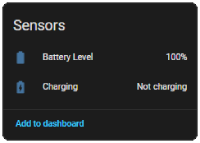

[![GitHub Release][releases-shield]][releases]
[![License][license-shield]][license]
[![hacs][hacs-badge]][hacs]
[![pre-commit][pre-commit-shield]][pre-commit]
[![Black][black-shield]][black]

# 🌀 Duux Fan - Local integration for Home Assistant

**Take back control of your Duux fan - locally, privately, and cloud-free.**

This project allows you to use your **Duux Whisper Flex smart fan** entirely outside of Duux’s cloud ecosystem by redirecting its MQTT communication to a **local broker**, giving you **full local control** via **Home Assistant**.

No cloud. No account. No lag.

## 📌 Supported models

This integration has been tested and validated on the following models:

- **Duux Whisper Flex**
- **Duux Whisper Flex 2**

The integration automatically adapts to your fan's capabilities based on the selected generation. It supports power, speed, modes, and horizontal/vertical oscillation... See the `Supported Features/Models` section below for details.

Other models may work but are not officially supported.
Please contribute your feedback to help improve compatibility.

## 🧩 Installation via HACS

This integration is not (yet) available in the official HACS default repository list.
However, you can easily add it as a **custom repository**:

[![Open your Home Assistant instance and open a repository inside the Home Assistant Community Store.][myha-repo-badge]][myha-repo]

1. Open **HACS** in your Home Assistant interface
2. Click the **three dots (⋮)** in the top-right corner and select **"Custom repositories"**
3. Paste the following URL:
   `https://github.com/LouisR-git/duux-fan-local`
4. Select **"Integration"** as the category
5. Click **Add**, then search for `Duux Fan Local` in HACS and install it
6. Restart Home Assistant to finalize the setup

The integration will now appear like any standard Home Assistant integration.

### Initial setup

1. Follow the **instructions below** to install the required prerequisites:
   - ✅ **DNS redirection** (reroute Duux API calls to your local Broker)
   - ✅ **MQTT Broker** (Mosquitto, EMQX, ...)

2. In Home Assistant, go to `Settings > Devices & Services > Add Integration` and search for `Duux Fan Local`.
3. Select your fan model from the list.
4. Give your device a friendly name.
5. Enter the **MAC address** of your Duux fan
   > 💡 You can find it in your router’s connected devices list.
6. Click **Submit** and enjoy local control of your fan!

### Screenshots




## 🧰 Prerequisites

Duux fans communicate with the cloud using **MQTT over TLS**.
By spoofing the cloud hostname and running your own MQTT broker, you can intercept this traffic and integrate the fan directly into Home Assistant.

You’ll need:

- **Control over your local DNS resolution** (AdGuard, CoreDNS, dnsmasq…)
- **A self-hosted MQTT broker**, reachable as `collector3.cloudgarden.nl` on port 443
- Basic Linux CLI knowledge

## 🌐 Local DNS spoofing

From your local DNS server, redirect the Duux cloud MQTT hostname to your local MQTT server’s IP.
```
collector3.cloudgarden.nl → 192.168.x.x
```

### Example: AdGuard DNS rewrite

Go to AdGuard → Settings → DNS Rewrites

### Example: Ubiquiti Unifi Gateway

Go to Console → Settings → Policy Engine → DNS → Create a new `Host (A)` entry

### Reboot the fan after DNS changes
Unplug → remove the battery → wait ~1 second → reinsert → power on.


## ⚙️ Setting up a local MQTT broker

### Option A - EMQX (TLS + Authentication) - **Recommended**
- **Goal:** A robust local setup with TLS encryption and username/password authentication.  
- 📖 See the [EMQX installation guide](docs/guide-emqx.md)

### Option B - Mosquitto (Anonymous TLS)
- **Goal:** The quickest option for labs or testing environments.  
- ⚠️ **Security:** Not secure (anonymous access).  
- 📖 See the [Mosquitto installation guide](docs/guide-mosquitto.md)


## 📋 Supported Features/Models

### Whisper Flex

| Feature             |   Key    | Command Payload    | Value X=                                          |
|---------------------|----------|--------------------|---------------------------------------------------|
| **Power**           | `power`  | `tune set power X` | `0`: off, `1`: on                                 |
| **Mode**            | `mode`   | `tune set mode X`  | `0`: fan mode, `1`: natural wind, `2`: night mode |
| **Speed**           | `speed`  | `tune set speed X` | `1` to `26`                                       |
| **Timer**           | `timer`  | `tune set timer X` | `0` to `12` hours                                 |
| **Horizontal Osc.** | `swing`  | `tune set swing X` | `0`: off, `1`: on                                 |
| **Vertical Osc.**   | `tilt`   | `tune set tilt X`  | `0`: off, `1`: on                                 |


### Whisper Flex 2
| Feature             |   Key    | Command Payload     | Value X=                               |
|---------------------|----------|---------------------|----------------------------------------|
| **Power**           | `power`  | `tune set power X`  | `0`: off, `1`: on                      |
| **Mode**            | `mode`   | `tune set mode X`   | `0`: fan mode, `1`: natural wind       |
| **Speed**           | `speed`  | `tune set speed X`  | `1` to `30`                            |
| **Timer**           | `timer`  | `tune set timer X`  | `0` to `12` hours                      |
| **Horizontal Osc.** | `horosc` | `tune set horosc X` | `0`: off, `1`: 30°, `2`: 60°, `3`: 90° |
| **Vertical Osc.**   | `verosc` | `tune set verosc X` | `0`: off, `1`: 45°, `2`: 100°          |
| **Night Mode**      | `night`  | `tune set night X`  | `0`: off, `1`: on                      |
| **Child Lock**      | `lock`   | `tune set lock X`   | `0`: off, `1`: on                      |
| **Battery Level**   | `batlvl` | N/A                 | `0` to `10`                            |
| **Charging Status** | `batcha` | N/A                 | `0`: not charging , `1`: charging      |

### Known Issues

- **Charging Status** does not update automatically when the battery is fully charged.
  The fan only refreshes this attribute when the Power state changes.
   This is a **firmware limitation**.


## 📡 Details

The fan uses MQTT topics to report its state and receive commands.

### MQTT Broker Endpoint
```
mqtts://collector3.cloudgarden.nl:443
```

### Fan publishes to:

| Topic                         | Example Payload                                                                 |
|-------------------------------|---------------------------------------------------------------------------------|
| `sensor/{device_id}/in`       | `{"sub":{"Tune":[{"uid":"xyz","power":1,"mode":0,"speed":10,"timer": 0,"horosc": 0,"verosc": 0,"lock": 0,"night": 1,"batcha": 0,"batlvl": 10}]}}` |
| `sensor/{device_id}/online`   | `{"online":true,"connectionType":"mqtt"}`                                       |
| `sensor/{device_id}/update`   | `{"pid":"xyz","tune":"DUUX Whisper Flex 2"}`                                    |

> The fan publishes data immediately when a change occurs, and otherwise every 30 seconds to keep the online status active.


### Fan subscribes to:

| Topic                          | Example Payload             |
|--------------------------------|-----------------------------|
| `sensor/{device_id}/command`   | `tune set speed 10`         |
| `sensor/{device_id}/config`    | _(Unused)_                  |
| `sensor/{device_id}/fw`        | _(Unused)_                  |


## ✅ Result

Your Duux fan is now fully **cloud-free** and controllable through **your local network** and **Home Assistant**.
Enjoy full privacy, instant response times, and true independence from proprietary services.

> **Note:** When connected to your local MQTT, the fan will no longer be able to receive firmware updates from the manufacturer.
> Disable local DNS forwarding and restart your fan to access the web again.

## 🛑 Disclaimer

This setup **spoofs a cloud domain** and runs services on privileged ports. Use only in **lab environments** or **isolated networks**.
For educational and interoperability purposes only.


## 🙌 Credits

Based on reverse engineering, packet sniffing, vibe coding ~~and a lot of fan noise~~.
A special thanks to the Home Assistant community for their valuable insights and contributions, especially the discussion in [this topic][ha-forum-duux-topic] which greatly helped this integration.
Contributions welcome! 🛠️


---

<!-- badge -->
[hacs]: https://hacs.xyz
[hacs-badge]: https://img.shields.io/badge/HACS-Custom-orange.svg?style=for-the-badge
[license]: https://github.com/LouisR-git/duux-fan-local/blob/main/LICENSE
[license-shield]: https://img.shields.io/github/license/LouisR-git/duux-fan-local.svg?style=for-the-badge
[releases]: https://github.com/LouisR-git/duux-fan-local/releases
[releases-shield]: https://img.shields.io/github/release/LouisR-git/duux-fan-local.svg?style=for-the-badge
[pre-commit]: https://github.com/pre-commit/pre-commit
[pre-commit-shield]: https://img.shields.io/badge/pre--commit-enabled-brightgreen?style=for-the-badge
[black]: https://github.com/psf/black
[black-shield]: https://img.shields.io/badge/code%20style-black-000000.svg?style=for-the-badge
[myha-repo]: https://my.home-assistant.io/redirect/hacs_repository/?repository=duux-fan-local&category=Integration&owner=LouisR-git
[myha-repo-badge]: https://my.home-assistant.io/badges/hacs_repository.svg
<!-- ref -->
[ha-forum-duux-topic]: https://community.home-assistant.io/t/experience-integrating-duux-products/386403

